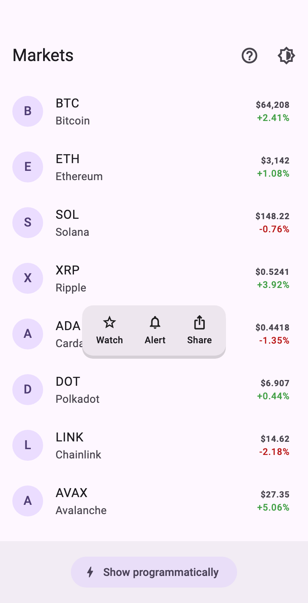
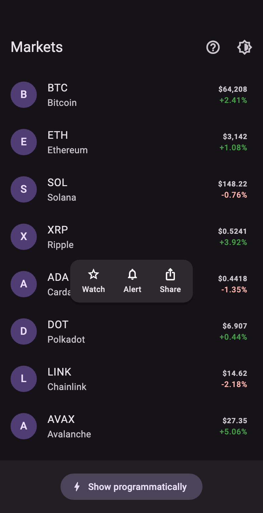

# anchored_popover

A Flutter popover that anchors to a **widget**, rather than to a screen edge.
It opens on a long press by default, follows its anchor while the list under it
scrolls, flips and clamps to stay on screen, and fades itself back out.

<p align="center">
  
  
</p>

```dart
AnchoredPopover(
  popoverBuilder: (context, dismiss) => TextButton(
    onPressed: () {
      addToWatchlist();
      dismiss();
    },
    child: const Text('Add to watchlist'),
  ),
  child: MarketRow(symbol: 'BTC'),
)
```

That is the whole of the common case: long-press the row, a small card opens
just above it, and three seconds later it fades away.

## Install

```bash
flutter pub add anchored_popover
```

```dart
import 'package:anchored_popover/anchored_popover.dart';
```

## Features

- Long-press, tap, secondary-click, or purely programmatic triggers.
- Optional auto-dismiss, outside-tap dismissal, and a scrim.
- A controller and a `GlobalKey` state API for imperative use.
- Screen-safe placement, with vertical flipping and edge clamping.
- Anchor following inside a scrollable — or dismissal on scroll, if you prefer.
- A theme extension, plus a reusable `PopoverSurface`.
- Directionality, ambient theme, localisation, and accessibility support.

## How it is positioned

The popover renders into the ambient `Overlay` — above dialogs, sheets, and
anything that clips — but it is positioned against its child. Placement puts
the popover's `followerAnchor` point onto the `targetAnchor` point of the
anchor's box, then shifts it by `offset`:

```dart
AnchoredPopover(
  // Below the anchor, instead of above it.
  targetAnchor: Alignment.bottomCenter,
  followerAnchor: Alignment.topCenter,
  offset: const Offset(0, 8),
  popoverBuilder: (context, dismiss) => const Text('Below'),
  child: const Icon(Icons.info_outline),
)
```

Two corrections then apply, in order. If the popover would spill past the top
or bottom edge and `flip` is set, the placement is mirrored to the anchor's
other side — but only when that side actually fits, so it never flips into a
worse position. Whatever still overflows is clamped inside the overlay's safe
area plus `screenPadding`. `PopoverLayoutDelegate` is public if you want the
same arithmetic elsewhere.

Pass an `AlignmentDirectional` for a side that should mirror in RTL. `offset`
is never mirrored.

## Triggers

`PopoverTrigger.longPress` is the default. A popover adds only the one
recogniser it needs, so gestures the child already handles keep working: a row
that is an `InkWell` with an `onTap` stays tappable.

| Trigger | Gesture |
| --- | --- |
| `longPress` | A long press. What a row in a list usually wants. |
| `tap` | A single tap, which toggles. |
| `secondaryTap` | A right click, or a two-finger trackpad tap. |
| `manual` | Nothing — the popover opens only through its controller. |

## Programmatic control

```dart
final popover = AnchoredPopoverController();

AnchoredPopover(
  controller: popover,
  trigger: PopoverTrigger.manual,
  autoDismiss: false,
  popoverBuilder: (context, dismiss) => const Text('Actions'),
  child: const Icon(Icons.more_horiz),
);

popover.show();
```

The controller holds the open state, so it survives the popover being rebuilt
and reads back correctly the moment `show()` returns rather than a frame later.
Auto-dismiss and tap-outside go through it too, so `isOpen` is never out of step
with what is on screen. Dispose a controller you create; one the widget created
for itself it disposes.

`AnchoredPopoverController.open()` starts open — the popover appears on the
frame after its anchor first has a size.

Code that would rather not hold a controller can reach the state directly:

```dart
final key = GlobalKey<AnchoredPopoverState>();
...
key.currentState?.toggle();
```

## Inside a scrolling list

By default the popover re-anchors itself as the enclosing scrollable moves, so
it stays pinned to its row. Only the position is recomputed, not the content.
Set `dismissOnScroll: true` for the other convention, or
`followAnchorOnScroll: false` to leave it where it opened.

## Theming

Register an `AnchoredPopoverTheme` on `ThemeData.extensions` to set defaults for
every popover and every `PopoverSurface` in the app. Anything a widget sets
itself wins over the theme; anything left unset on both falls back to
`AnchoredPopoverTheme.withDefaults`, which derives its colours from the ambient
`ColorScheme`.

```dart
ThemeData(
  extensions: const [
    AnchoredPopoverTheme(
      borderRadius: BorderRadius.all(Radius.circular(14)),
      padding: EdgeInsets.all(4),
      showDuration: Duration(seconds: 4),
    ),
  ],
)
```

`PopoverSurface` is the card the popover paints behind its content — a filled,
rounded, shadowed `Material` with padding. It is a plain widget, useful on its
own for anything that should match your popovers. Pass `decorate: false` to
paint everything yourself; the content is still put in a transparent `Material`
so text styles and ink respond normally.

## Properties

| Property | Default | What it does |
| --- | --- | --- |
| `child` | — | The anchor. Laid out and hit-tested as if the popover were not there. |
| `popoverBuilder` | — | Builds the content, and is handed a `dismiss` callback. |
| `trigger` | `longPress` | The gesture on `child` that opens the popover. |
| `controller` | internal | Opens and closes it from elsewhere. |
| `targetAnchor` | `topCenter` | The point of `child` it is placed against. |
| `followerAnchor` | `bottomCenter` | The point of the popover put onto that point. |
| `offset` | `Offset(0, -8)` | Shift applied once the anchors line up. |
| `autoDismiss` | `true` | Whether it closes itself after `showDuration`. |
| `showDuration` | 3 s | How long it stays up when `autoDismiss` is set. |
| `dismissOnTapOutside` | `true` | Whether a tap outside closes it. The tap is absorbed. |
| `dismissOnScroll` | `false` | Whether scrolling closes it instead of moving it. |
| `followAnchorOnScroll` | `true` | Whether it re-anchors as the scrollable moves. |
| `flip` | `true` | Whether it may flip to the anchor's other side. |
| `barrierColor` | none | Colour of a full-screen scrim, which also absorbs taps. |
| `decorate` | `true` | Whether to wrap the content in a `PopoverSurface`. |
| `screenPadding` | `EdgeInsets.all(8)` | How close to the overlay's edge it may sit. |
| `transitionDuration` | 120 ms | Fade and scale in. |
| `reverseTransitionDuration` | 90 ms | Fade and scale out. |
| `curve` / `reverseCurve` | `easeOutCubic` / `easeIn` | Transition curves. |
| `semanticLabel` | none | Announced by screen readers when it opens. |
| `onShow` / `onDismiss` | none | Called when it opens and when it starts closing. |

## Accessibility

The long-press recogniser is not excluded from semantics: it contributes a
long-press action to the child's node, which is how a screen-reader user reaches
the popover at all. Give `semanticLabel` a value when the content is not
readable on its own, and it is announced as a live region when the popover
opens.

Because the content renders through an `OverlayPortal`, it is built in the
anchor's own place in the tree — so `Theme`, `Directionality`, `MediaQuery` and
your localisations resolve exactly as they do for `child`, and there is no
`OverlayEntry` left to leak if the anchor is disposed while the popover is up.

## Example

A runnable market list is in [`example/`](example/lib/main.dart) — the app the
screenshots above were taken from.

```bash
cd example && flutter run
```

## License

MIT — see [LICENSE](LICENSE).
